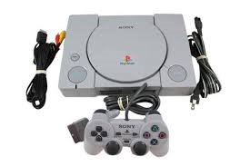

<!DOCTYPE html>
<html lang="en">
<head>
    <meta charset="UTF-8">
    <meta http-equiv="X-UA-Compatible" content="IE=edge">
    <meta name="viewport" content="width=device-width, initial-scale=1.0">
    <title>Document</title>
</head>

<body>

        
     <button onclick="cambioImagen('ps1');">PS1</button>
     <button onclick="cambioImagen('ps2');">PS2</button>
     <button onclick="cambioImagen('ps3');">PS3</button>
     <button onclick="cambioImagen('ps4');">PS4</button>
     <button onclick="cambioImagen('ps5');">PS5</button>

</body>
</html>
